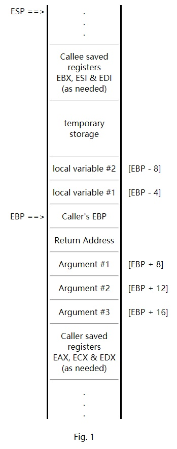

# c c++函数调用约定

## 1. 概览

| 分类                 | \__stdcall       | __cdecl          | __fastcall                                                           |
| -------------------- | ---------------- | ---------------- | -------------------------------------------------------------------- |
| 参数传递的方法       | 从右向左压栈     | 从右向左压栈     | 如果左边的2个参数小于4字节，则放于ECX和EDX中，剩余的参数从右向左压栈 |
| 谁负责清理栈         | 被调函数自己清理 | 调用方清理       | 调用方调用清理？？                                                   |
| 使用场景             | win API          | MFC C++ 变长参数 | 考虑速度                                                             |
| C 函数签名装饰约定   |                  |                  |                                                                      |
| c++ 函数签名装饰约定 |                  |                  |                                                                      |


## 2. 参数压栈 和 返回值的处理

### 2.1 小于等于4字节参数。直接压栈

``` asm
push        2
或者
003C533A  lea         eax,[dddd]                    // 读取对象的地址
003C533D  push        eax                           // Test2::Test2拷贝构造函数的压参
```

### 2.2 大于4字节的参数。例如函数的参数为对象

1. 调用方在在栈上分配临时对象，大小为对象所需的大小（注意：只是分配内存，但没有调用构造函数）

``` x86asm
003C5335  sub         esp,0Ch                       // 分配所需的内存
003C5338  mov         ecx,esp                       
003C533A  lea         eax,[dddd]                    // 读取对象的地址
003C533D  push        eax                           // Test2::Test2拷贝构造函数的压参
003C533E  call        Test2::Test2 (03C13C0h)       // 调用拷贝构造函数，初始化上面分配的内存
```

### 2.3 this指针的处理

1. this指针被存储在ECX寄存器中，参数还是从右向左压栈

```
	dddd.getAge(0);
007C5394  push        0                                 // 首先压栈参数
007C5396  lea         ecx,[dddd]                        // 将this指针放到ecx中
007C5399  call        Test2::getAge (07C13CFh)  
```

### 2.4 返回值的处理

1. 小于等于4字节的返回值，存储在EAX寄存器中

    ``` x86asm
    int ww = foo3(1, 2);
    00ED5329  push        2  
    00ED532B  push        1  
    00ED532D  call        foo3 (0ED13B6h)               // foo3的返回值存储在EAX中
    00ED5332  add         esp,8  
    00ED5335  mov         dword ptr [ww],eax            // 调用方会将EAX，赋值给变量
    ```

2. 大于4字节的返回值
   - 调用方会额外传递一个参数到被调函数，且作为第一个参数，这个参数是对象的地址

        ```armasm
        Test2 dddd = foo2(1, 2);                            // foo2函数返回一个对象
        003C5319  push        2                             // 从右向左压参，先压最后一个参数
        003C531B  push        1  
        003C531D  lea         eax,[dddd]  
        003C5320  push        eax                           // 压参，额外传递的参数
        003C5321  call        foo2 (03C12A8h)  
        003C5326  add         esp,0Ch                       // 调用方，回收掉参数所占用的内存
        ```

## 3. 函数签名

- 函数签名（修饰名） 是由 函数名、类名、名字空间名、调用约定、返回值类型、参数类型等决定

## 3. C 函数签名修饰约定

3.1 __stdcall

- 组成： 下划线 + 函数名 + @ + 参数的总大小
- 例子： int func(int age);   ----->   _func@4

3.2 __cdecl

- 组成： 下划线 + 函数名
- 例子： int func(int age);   ----->   _func

3.2 __fastcall

- 组成： @ + 函数名 + @ + 参数的总大小
- 例子： int func(int age);   ----->   @func@4


## 4. C++ 函数签名修饰约定

4.1 __stdcall

- 组成：? + 函数名 + @@YG + 返回值类型 + 参数列表的各个参数类型 + @Z（@Z表示结束）
- 例子：float __stdcall goo(int,void *,class Test,class Test *,class Test2 *,int)  ---> (?goo@@YGMHPAXVTest@@PAV1@PAVTest2@@H@Z)
- 参数类型的编码：（不全）
  - X--void,
  - D--char,
  - e--unsigned Char,
  - F--short,
  - H--int,
  - i--unsigned int,
  - J--long,
  - K--unsigned Long,
  - M--float,
  - N--double,
  - _n--bool,
  - PA -- 表示指针。PAVTest2@@--  PA表示指针，VTets2表示类名-暗示了指针的类型，@@表示结束

- 解析
  - \?goo@@YGMHPAXVTest@@PAV1@PAVTest2@@H@Z
    - @@Y表示开始
    - M ：返回值类型
    - H：第一个参数类型
    - PAX：表示指针，类型为void*
    - VTest@@：表示类型，类名为Test  @@表示字符串的结束
    - PAV1@：表示指针，1表示类型为列表中第一个出现的指针的类型，即 Test*，@表示指针的结束
    - PAVTest2@@：表示指针，类型为Test2
    - H：表示整型
    - @Z: 表示结束

4.2 __cdecl

- 基本跟__stdcall相同，除了@@YG变成了@@YA
  
4.3 __fastcall

- 基本跟__stdcall相同，除了@@YG变成了@@YI


## 5. extern "C"

5.1 extern "C" 是c++的关键字，在C中没有，用于c++调用C函数（c的dll库）

- 产生的原因：c、c++的函数签名的修饰方式不同，上面已经提到了

## 6. c调用C++的类

<http://www.jonathanbeard.io/tutorials/Mixed_C_C++>


## 7. 动态链接库的默认导出函数

7.1 Unix

- unix 上全局函数，默认都是导出的
  
7.2 Windows

- windows上默认都不是导出的，需要使用

    ``` c
    #if COMPILING_THE_DLL
        #define DLLEXTERN __declspec(dllexport)
    #else
        #define DLLEXTERN __declspec(dllimport)
    #endif
    ```

7.3 使用案例

``` c
#if defined(_MSC_VER)
    //  Microsoft 
    #define EXPORT __declspec(dllexport)
    #define IMPORT __declspec(dllimport)
#elif defined(__GNUC__)
    //  GCC
    #define EXPORT __attribute__((visibility("default")))
    #define IMPORT
#else
    //  do nothing and hope for the best?
    #define EXPORT
    #define IMPORT
    #pragma warning Unknown dynamic link import/export semantics.
#endif
```

``` c
#if MY_LIB_COMPILING
#   define MY_LIB_PUBLIC EXPORT
#else
#   define MY_LIB_PUBLIC IMPORT
#endif
```

To use this, you mark your functions and classes like this:

``` c
MY_LIB_PUBLIC void foo();

class MY_LIB_PUBLIC some_type
{
    // ...
};
```

## 8. 函数调用栈

<https://www.csee.umbc.edu/~chang/cs313.s02/stack.shtml>

