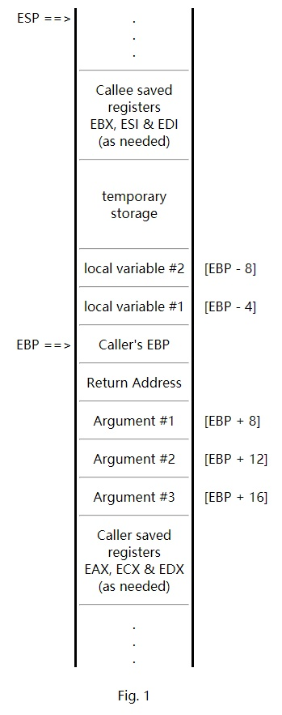
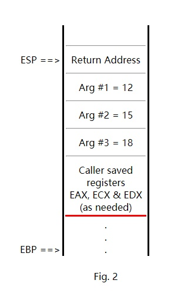
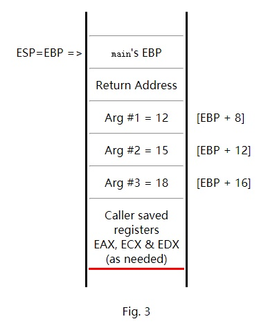
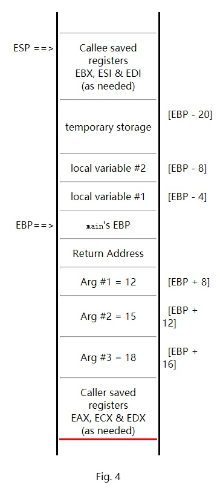
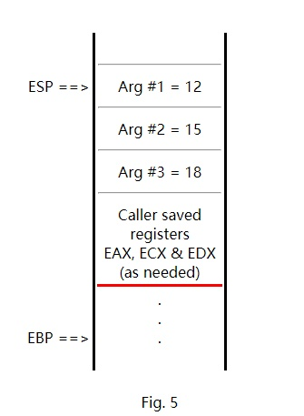

## 参考

<https://www.csee.umbc.edu/~chang/cs313.s02/stack.shtml>

---

## C Function Call Conventions and the Stack

---
[Revised 10/18/2001 for better compatibility with Netscape. -RC]

---
In this page we will review how a stack frame is set up and taken down when a C function call is made. The details are accurate for the platform and compiler we are using, gcc on Linux running on an Intel Pentium chip. There are many possible ways to set up a stack frame --- a different compiler, processor or operating system could use a different set of conventions.

### A typical stack frame

Figure 1 on the right is what a typical stack frame might look like. In these diagrams, the stack grows upward and smaller numbered memory addresses are on top.
This would be the contents of the stack if we have a function foo with the prototype:

   `int foo (int arg1, int arg2, int arg3) ;`
and foo has two local int variables. (We are assuming here that sizeof(int) is 4 bytes). The stack would look like this if say the main function called foo and control of the program is still inside the function foo. In this situation, main is the "caller" and foo is the "callee".
The ESP register is being used by foo to point to the top of the stack. The EBP register is acting as a "base pointer". The arguments passed by main to foo and the local variables in foo can all be referenced as an offset from the base pointer.

The convention used here is that the callee is allowed to mess up the values of the EAX, ECX and EDX registers before returning. So, if the caller wants to preserve the values of EAX, ECX and EDX, the caller must explicitly save them on the stack before making the subroutine call. On the other hand, the callee must restore the values of the EBX, ESI and EDI registers. If the callee makes changes to these registers, the callee must save the affected registers on the stack and restore the original values before returning.

Parameters passed to foo are pushed on the stack. The last argument is pushed first so in the end the first argument is on top. Local variables declared in foo as well as temporary variables are all stored on the stack.

Return values of 4 bytes or less are stored in the EAX register. **If a return value with more than 4 bytes is needed, then the caller passes an "extra" first argument to the callee**. This extra argument is address of the location where the return value should be stored. I.e., in C parlance the function call:

   `x = foo(a, b, c) ;`
is transformed into the call:
  ` foo(&x, a, b, c) ;`
Note that this only happens for function calls that return more than 4 bytes.
Let's go through a step-by-step process and see how a stack frame is set up and taken down during a function call.



---

### The caller's actions before the function call
	 		 


Fig. 2In our example, the caller is the main function and is about to call a function foo. Before the function call, main is using the ESP and EBP registers for its own stack frame.
First, main pushes the contents of the registers EAX, ECX and EDX onto the stack. This is an optional step and is taken only if the contents of these 3 registers need to be preserved.

Next, main pushes the arguments for foo one at a time, last argument first onto the stack. For example, if the function call is:
     `a = foo(12, 15, 18) ;`
The assembly language instructions might be:

```
push    dword 18 
push    dword 15
push    dword 12
```

Finally, main can issue the subroutine call instruction:` call    foo`
**When the call instruction is executed, the contents of the EIP register is pushed onto the stack, so ESP also changes**. Since the EIP register is pointing to the next instruction in main, the effect is that the return address is now at the top of the stack. After the call instruction, the next execution cycle begins at the label named foo.
Figure 2 shows the contents of the stack after the call instruction. The red line in Figure 2 and in subsequent figures indicates the top of the stack prior to the instructions that initiated the function call process. We will see that after the entire function call has finished, the top of the stack will be restored to this position.

---

### The callee's actions after function call

When the function foo, the callee, gets control of the program, it must do 3 things: set up its own stack frame, allocate space for local storage and save the contents of the registers EBX, ESI and EDI as needed.
So, first foo must set up its own stack frame. The EBP register is currently pointing at a location in main's stack frame. This value must be preserved. So, EBP is pushed onto the stack. Then the contents of ESP is transferred to EBP. This allows the arguments to be referenced as an offset from EBP and frees up the stack register ESP to do other things. Thus, just about all C functions begin with the two instructions:

```c
        push    ebp
        mov     ebp, esp
```

The resulting stack is shown in Figure 3. Notice that in this scheme the address of the first argument is 8 plus EBP, since main's EBP and the return address each takes 4 bytes on the stack.	
	 		 



---

In the next step, foo must allocate space for its local variables. It must also allocate space for any temporary storage it might need. For example, some C statements in foo might have complicated expressions. The intermediate values of the subexpressions must be stored somewhere. These locations are usually called temporary, because they can be reused for the next complicated expression. Let's say for illustration purposes that foo has 2 local variables of type int (4 bytes each) and needs an additional 12 bytes of temporary storage. The 20 bytes needed can be allocated simply by subtracting 20 from the stack pointer:
        `sub     esp, 20`
The local variables and temporary storage can now be referenced as an offset from the base pointer EBP.
Finally, foo must preserve the contents of the EBX, ESI and EDI registers if it uses these. The resulting stack is shown in Figure 4.

The body of the function foo can now be executed. This might involve pushing and popping things off the stack. So, the stack pointer ESP might go up and down, but the EBP register remains fixed. This is convenient because it means we can always refer to the first argument as [EBP + 8] regardless of how much pushing and popping is done in the function.

Execution of the function foo might also involve other function calls and even recursive calls to foo. However, as long as the EBP register is restored upon return from these calls, references to the arguments, local variables and temporary storage can continue to be made as offsets from EBP.

	 	


---

### The callee's actions before returning
	 		 


Fig. 5Before returning control to the caller, the callee foo must first make arrangements for the return value to be stored in the EAX register. We already discussed above how function calls with return values longer than 4 bytes are transformed into a function call with an extra pointer parameter and no return value.
Secondly, foo must restore the values of the EBX, ESI and EDI registers. If these registers were modified, we pushed their original values onto the stack at the beginning of foo. The original values can be popped off the stack, if the ESP register is pointing to the correct location shown in Figure 4. So, it is important that we do not lose track of the stack pointer ESP during the execution of the body of foo --- i.e., the number of pushes and pops must be balanced.

After these two steps we no longer need the local variables and temporary storage for foo. We can take down the stack frame with these instructions:

```
        mov     esp, ebp
        pop     ebp
```

`pop ebp`: 1) pop off the stack 2) assign the value to ebp

The result is a stack that is exactly the same as the one shown in Figure 2. call. The result is the stack shown in Figure 5.
The i386 instruction set has an instruction "leave" which does exactly the same thing as the mov and pop instructions above. Thus, it is very typical for C functions to end with the instructions:
```
        leave
        ret
```

---

### The caller's actions after returning

After control of the program returns to the caller (which is main in our example), the stack is as shown in Figure 5. In this situation, the arguments passed to foo is usually not needed anymore. We can pop all 3 arguments off the stack simultaneously by adding 12 (= 3 times 4 bytes) to the stack pointer:
  `      add     esp, 12`
The caller main should then save the return value which was placed in EAX in some appropriate location. For example if the return value is to be assigned to a variable, then the contents of EAX could be moved to the variable's memory location now.
Finally, the main function can pop the values of the EAX, ECX and EDX registers if their values were preserved on the stack prior to the function call. This puts the top of the stack at the exact same position as before we started this entire function call process. (Recall that this position is indicated by a red line in Figures 2-5.)

---

## Examples

Understanding these conventions lets you do two things: 1) write assembly language programs that can be called from a C program, and 2) call standard C functions from your own assembly language programs.
As an example of the first case, we have a function arrayinc written in assembly language that adds one to each element of an integer array. The array is passed to arrayinc as the only argument. Here are the files:

- The assembly language program that implements arrayinc: arrayinc.asm.
- The C function that calls the arrayinc function: arraytest.c.
- A transcript of the UNIX commands & output: arraytest.txt.

Notice that the C program treats arrayinc as any other function that is implemented elsewhere. It really doesn't care if the function is implemented in C or in assembly language.
The second situation, calling C functions from assembly language programs, is commonly used to invoke C input/output routines. Here you must decide if your main function will behave like a C function or as an a "normal" assembly language program.

An example of the first case, we call printf from an assembly language program. The entry point for the assembly language program is labeled main and must be declared global. This program must behave like a C function. It must set up and take down the stack frame and preserve the registers according to the C function call convention. The identifier printf must be declared external to get the linker to do the right thing. We also use gcc to do the final linking and loading (instead of using ld), since gcc knows which library contains the printf function. Here are the files:

- An assembly language program that calls printf (version 1): printf1.asm.
- A transcript of the UNIX commands & output: printf1.txt.

In the second example, the assembly language program is a "normal" one. The entry point is labeled "_start" and the program exits using a Linux kernel system call. In this case, we need to give gcc the "-nostartfiles" option for the linking to work correctly.

- An assembly language program that calls printf (version 2): printf2.asm.
- A transcript of the UNIX commands & output: printf2.txt.

A good way to understand how C handles function calls is to examine the assembly language code generated by the compiler. We can use "gcc -S" to tell the gcc compiler to create a file with extension ".s" that contains the assembly language code. The gcc compiler does normally generate assembly language code, but without the -S option it does not save it to a file. Unfortunately the assembly code in the .s file is in AT&T-style syntax. This can be converted to Intel-style syntax using an "intel2gas" command.

Here are the files from a simple example.

- The original C program: cfunc.c.
- The assembly output in AT&T style: cfunc.s.
- The assembly output converted to Intel style: cfunc.asm.
- A transcript of the UNIX commands & output: cfunc.txt.

For a more complicated example, look at the assembly code generated by gcc for a program with nested function calls:

- The original C program: cfunc2.c
- The converted assembly language output in Intel style: cfunc2.asm.

Finally, we have an example with a C function with a return value with size more than 4 bytes.

- The original C program: cfunc3.c.
- The converted assembly language output in Intel style: cfunc3.asm. The comments in this file were added afterwards.
