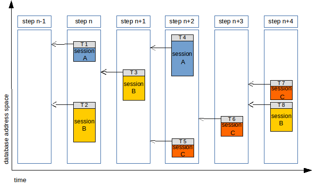
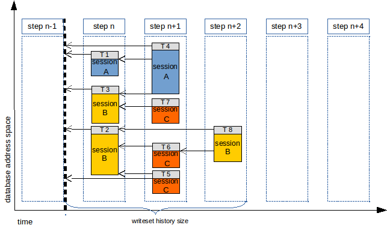
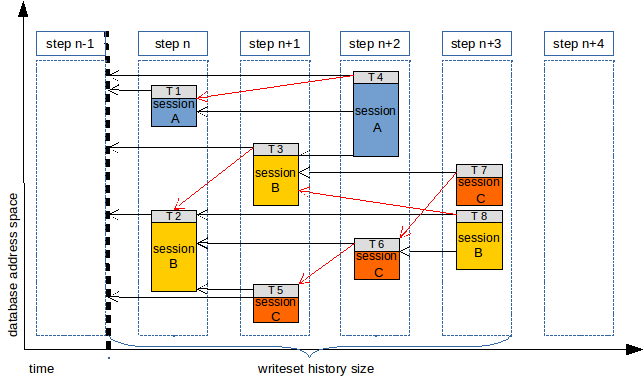
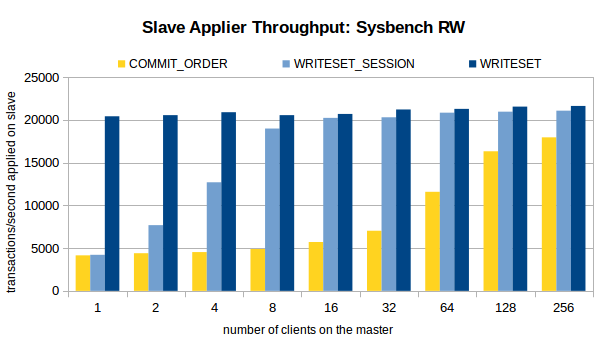
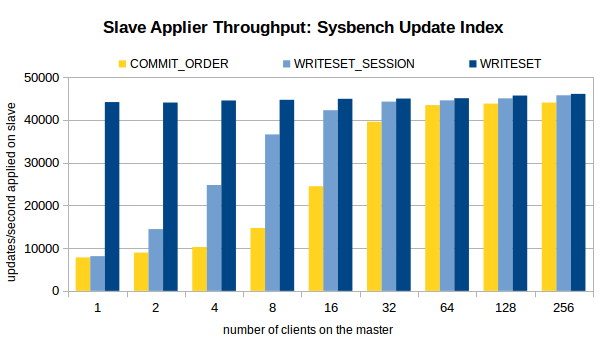
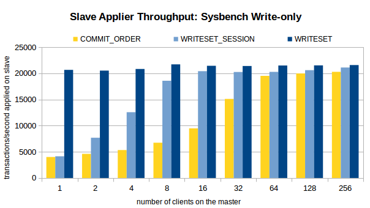

### 参考

- <https://mysqlhighavailability.com/improving-the-parallel-applier-with-writeset-based-dependency-tracking/>

### 正文
> Improving the Parallel Applier with Writeset-based Dependency Tracking
April 24, 2017MySQL, Performance, ReplicationVitor Oliveira
MySQL 8.0.1 introduces a new mechanism to track the dependencies between transactions. This feature is used to optimize the binary log applier on asynchronous replication slaves, improving the throughput significantly on workloads where there is low-concurrency on the master and/or on systems with very fast storage.

> Before diving into that let me provide a bit of context for those unfamiliar with MySQL’s parallel binary log applier (the others please skip to next section).

1. A bit of history: slave lag and the parallel slave applier

MySQL replication tries to keep two or more servers in sync by sending the updates to a master database and applying them to multiple database replicas. For that, replication adds some extra work on the master to extract the changes, writes them to disk and sends them over the network at the replicas request. Those changes are then applied asynchronous on the replicas, typically as soon as possible and while clients are issuing read requests. The time interval from the moment a transaction is committed on the master until it is committed on a replica is usually called the slave lag.

The slave lag is composed of two parts: a (mostly) fixed part which is dependent on the replication pipeline – associated with having to transfer a transaction to a remote server and executing it only after it has finished on the master – and a variable part that grows when the binary log applier on the replicas is unable to handle the write workload as quickly as it arrives from the master and creates some back-log on the applier. An optimized system should have a short slave lag (depending on transaction size and network distance) that does non-vary significantly over time.

When the slave lag grows over time a possible reason is that the throughput of the slave applier is insufficient to match the throughput of the master. In MySQL version 5.5 and earlier the binary log applier on the slaves was single-threaded, and that became a bottleneck when the available machines went from the one-core per processor, typical at the time, to many-cores per processor. However, the single-threaded applier is still effective on deployments where there is a large proportion of reads over writes.

When multi-core machines became the norm, replication had to start using multiple threads to properly explore the underlying server parallelism. For that to work correctly, the transactions that can run in parallel have to be identified and those found to be dependent need to be executed on the slave in the same sequence as on the master to maintain data consistency.

MySQL 5.6 introduced the DATABASE parallel replication scheme, which considers that any transactions that work on different databases can be executed in parallel on the slave applier.  At this time more and more sharded systems were being deployed and in many of such deployments this parallelization scheme would fit quite nicely. On the other hand, there were still deployments that could not take advantage of the multi-threaded applier, as some users could not afford to tweak their workloads and extend them to multiple underlying databases to take full advantage of this parallelization approach.

Then MySQL 5.7 introduced the LOGICAL_CLOCK parallel replication scheme, extending parallelism to transactions within the same database. Initially it considered that only transactions that committed together on the same binary log group commit could be executed together on the slave, but then that was improved upon to work on intervals of dependencies, reducing the impact of serialization points that were seen at group commit boundaries. Nevertheless, this approach still works best when there are many transactions committing together, which happens either when the storage system sync time is high and/or when there are many concurrent connections on the master.

Again moving forward, storage has become much less of a bottleneck then it used to, and as a consequence commit group sizes have decreased with it. And while MySQL allows delays to be set on the master so that more transactions are bundled at each low-level commit – at the cost of delaying the master while that happens – only one transaction per client can be bundled at commit time, so in workloads with little client parallelism the benefit cannot be increased. That is visible when we go through intermediate replicas that apply the workloads with less threads then the original workload, which loose some concurrency as we go through multi-layer topologies.

2. WRITESET transaction dependency tracking on the master

The recently released MySQL 8.0.1 DMR introduces a new way to track transaction dependencies based on the data that is touched by each transaction. Following on the work done for Group Replication, asynchronous replication can now also check which transactions overlap, or not, based on their writesets. Those that don’t overlap are marked as being independent and can be applied in parallel in the replicas.

Let’s suppose we have a simple workload that using current dependency tracking scheme would identify 5 different steps, in which each all transactions depended on previous step:

When this workload is executed on the slave, it will be allowed to execute T1 and T2 in parallel, then T3 alone, then T4 and T5 in parallel, then T6 alone, then finally T7 and T8 together.

If we use dependency tracking using WRITESETs on the master, those writesets are preserved over time, up to a maximum history size, and then the dependency information is generated based on that. I will not dive on how the writeset represents the data touched by a transaction, there are several blog posts about that in Group Replication for those interested, in complement to the details in WL#8440 and WL#9556. Lets just assume transactions are represented by a set of hashes and if the sets from two different transactions overlap then that’s because they change overlapping rows.

So using WRITESET the previous workload could be executed on the slave using the following order:

In this case, using WRITESET we can go from running at most 2 transactions to running up to 4 transactions in parallel. In fact, the number o steps can even be reduced from 5 to 3, because the moment at which the transaction was executed is not relevant.

But the reader may ask: what if T3 commits before T2 on the slave, or T7 before T5, can’t the slave see an execution history from the same session that is different from that seen on the master? That can indeed happen, as it already happens between different sessions with current applier unless the slave-preserve-commit-order option is ON.

Users need to assess if that is acceptable or not, but even if reordering cannot happen WRITESET dependency tracking can still be used, in two ways. The first one is using the mentioned slave-preserve-commit-order option which forces the order on the master to be kept on the slave even between different session as long as the slave as binary logs. The second way is to use a special WRITESET mode, WRITESET_SESSION, which never allows the transactions from the same session to be executed in parallel.

With WRITESET_SESSION the ordering on the slave would be something like:

The new behaviour is controlled by the variable binlog-transaction-dependency-tracking, which can assume the values COMMIT_ORDER to preserve previous behaviour (the default) and WRITESET or WRITESET_SESSION for the introduced features.

There are a few requirements to use WRITESET and WRITESET_SESSION, mainly resulting from the fact the transaction writesets must be extracted for each transaction, using the transaction-writeset-extraction option set to either XXHASH64 or MURMUR32. To generate transaction writesets we depend on having primary or unique keys to properly identify the rows, so tables without them cannot benefit from WRITESET. For different reasons, the same happens to transactions that include DDL, access parent tables in foreign keys relations and those with empty or only partial writesets.

But it’s important to note that the WRITESET dependency tracker never generates dependencies that are worse than those from COMMIT_ORDER, as WRITESET will only replace the existing commit_parent when it can deliver a more optimized one. What implies that even when WRITESET is not capable of properly be used, such as for tables with no usable keys, parent tables of foreign key dependencies, etc., it can still be selected to improve the other cases.

1. Performance Evaluation

To assess the benefit of using the WRITESET and WRITESET_SESSION dependency tracking we performed a set of benchmarks comparing it to COMMIT_ORDER in MySQL 8.0.1. The following charts present the applier throughput obtained after executing three Sysbench workloads on the master: OLTP Read/Write, Write-only and Update Indexed Column.

The workloads were executed on a master with the applier on the slave stopped, then the execution time to apply 1 million transactions was measured to calculate the applier throughput in transactions or updates per second. The 16 slave applier threads executed alone (using local relay log), bound to 16 processor cores of a Xeon E5-2699-V3 based machine, using a database with 16 tables and 8 million rows stored on a local SSD disk. The database and binary log were configured with no durability settings, in order to show the full potential of the approach and not allow delays in the storage system that hide it.

Main observations:

1. Using current dependency tracking scheme, COMMIT_ORDER, when the number of clients on the master is small (16 or less on Sysbench RW and 4 or less on Sysbench Update Index) the benefit of using the parallel applier on the slave is small, as there is little oportunity to find transactions that have the locks set in the same moment.

2. When WRITESET dependency tracking is used, the maximum slave applier throughput is reach at any client configuration on the master. In fact, even with a single-client on the master the throughput on the slave is a bit higher then when 256 threads are used with COMMIT_ORDER.

3. Like COMMIT_ORDER, WRITESET_SESSION depends on the number of clients in the master. But it reaches higher throughput at much lower number of clients, delivering a significant gain even after two clients are used, and more then twice the throughput at only 4 clients.

**4. Conclusions**

- As the charts above show, using dependency tracking on the master based on transaction writesets can improve the slave applier parallelism significantly. The throughput of the binary log applier on the slave no longer relies on the execution order alone to track transactions that can be executed in parallel. It provides almost the maximum throughput independently of the number of clients on the master, requires no throttling on the master to benefit from larger group commits, and maintains parallelism even when the number of intermediate masters is high.

- This feature also allows the slave to catch up quickly, after being stopped or in/after recovery in Group Replication, as even single-threaded workloads can execute at the maximum capacity of the slave applier.

- I’m quite excited with this feature, not only because it brings a great throughput improvement on the slave when the number of clients on the master is low, but also because it opens interesting optimization opportunities to explore in the future.

- But the benefit from this feature may translate differently to other workloads, so please test it with your own workloads and systems to properly evaluate it. If you do, please report any problems you may find with it, or any suggestions you may have.
  
- Nevertheless, for a preview on how this feature behaves in a very demanding production environment please check Jean-François Gagné’s session at Percona Live with details of his early testing of it.

- One interesting implementation detail is that WRITESET dependency tracking is compatible to what is expected by MySQL 5.7 when using the LOGICAL_CLOCK scheduler. Because of that MySQL 5.7 slaves can take advantage of the added parallelism of MySQL 8.0.1 masters without being forced to upgrade throughout. So, here is a suggestion: why don’t you put an intermediate MySQL 8.0.1 server between two existing MySQL 5.7 servers to evaluate potential improvements?