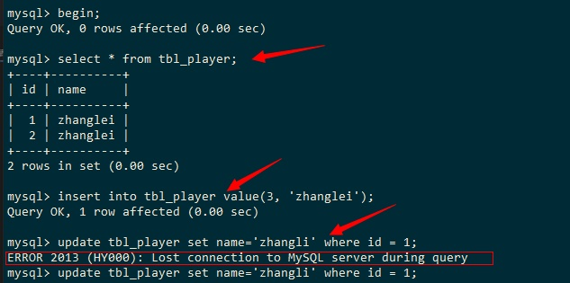
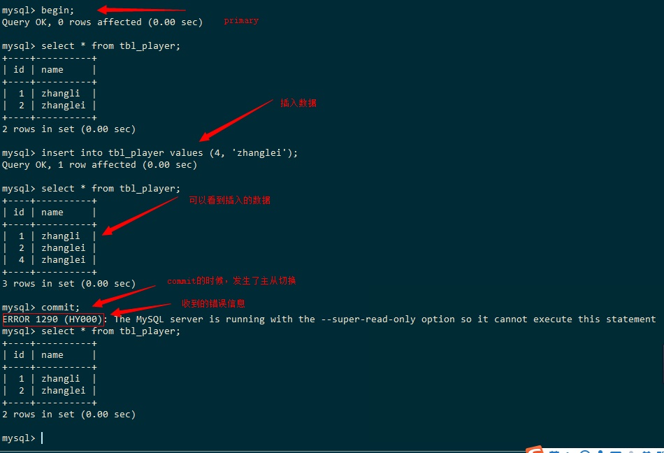

# client ---> mysqlrouter ----> mgr &emsp; client需要处理的问题问题

## 1. group_replication_consistency = BEFORE_ON_PRIMARY_FAILOVER 时

- 发生主从节点切换的时候，新的主节点在应用积压的事务时（apply backlog)，new RO、RW事务连接到新的主节点，新的主节点会hold这些事务（接受事务但是不返回给client）直到积压完成
- 从client的角度看，**事务执行被阻塞了，但是不会返回错误**

## 2. 事务执行到一半发生主从切换

- 一个事务

    ``` sql
    begin;
    sql1;
    sql2;
    commit;
    ```

- client通过router连接到primary-node: nodeA，事务执行到了sql1, 在执行sql2的时候发生了主从切换
- 执行sql2的时候，client会收到错误返回：失去连接
    
- 此时在执行 mysql_ping()是ping不通的
- 此时同mysqlrouter重新建立连接，会同new elected primary node建立连接，此时能建立连接
- 但接下来执行事务的时候，会回到 1 的问题中去，比如：此时构建预编译语句
  - [ ] 构建预编译语句 应该是不会阻塞的。 需要确认
  - [x] 但是执行事务，如果begin；sql，是会阻塞的 


# client ---> mgr &emsp; 问题

## 1. 事务执行到一半时，发生主从切换

- 示例


- 注意点

    ``` sql
    begin;
    sql1;
    sql2;
    commit;
    ```

  - mgr的共识阶段，仅仅在commit的时候触发
  - begin的时候，mgr也会处理，例如GROUP_REPLICATION_CONSISTENCY_BEFORE_ON_PRIMARY_FAILOVER这种一致性
  - 执行sql1的时候，mgr也会处理，函数group_replication_trans_before_dml，次函数都是验证，不会阻塞

# 失去连接的错误码

- 2013; Symbol: CR_SERVER_LOST;
  - Message: Lost connection to MySQL server during query
- 2006; Symbol: CR_SERVER_GONE_ERROR;
  - Message: MySQL server has gone away
- 2003; Symbol: CR_CONN_HOST_ERROR;
  - Message: Can't connect to MySQL server on '%s:%u' (%d)