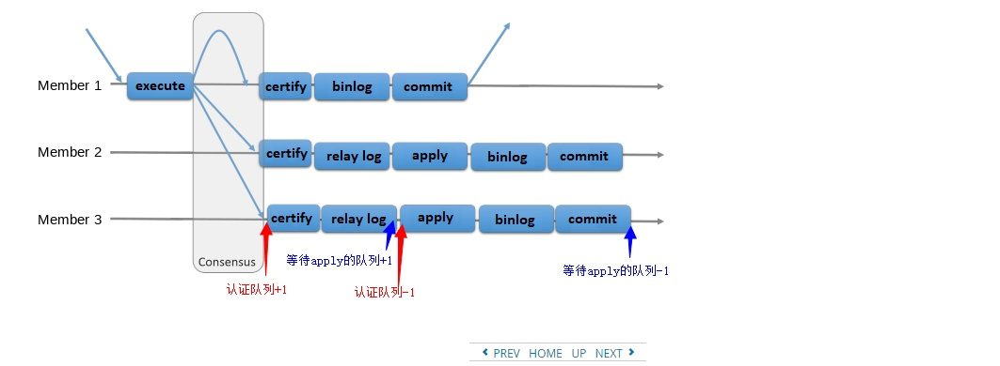

# Mgr的成员统计信息

## 1. 主要关心的几个统计信息（replication_group_member_stats Table）
  
| 项                                         | 含义                                   | 动作                                                                         |
| ------------------------------------------ | -------------------------------------- | ---------------------------------------------------------------------------- |
| COUNT_TRANSACTIONS_IN_QUEUE                | 等待冲突检查的事务数（认证队列的大小） | 冲突检查，写入relay-log（relay-log的实现是带缓冲的，也就是不一定发生磁盘io） |
| COUNT_TRANSACTIONS_REMOTE_IN_APPLIER_QUEUE | 等待apply的事务数（应用队列的大小）    | 从relay-log读取信息，执行事务，commit                                        |

## 2. 统计信息项的意义

- COUNT_TRANSACTIONS_IN_QUEUE   （认证队列）
  - 此值过大，主要表明磁盘io不足
  - 单主模式下，不存在冲突认证（虽然走了流程，但实际没有认证的处理），cpu的消耗是非常小的
-  
- COUNT_TRANSACTIONS_REMOTE_IN_APPLIER_QUEUE (应用队列的大小)
  - 此值过大，主要表明磁盘io不足，次要表明cpu问题
-  
- **特别注意**
  - 这些统计信息，组成员每隔1秒将自身的统计信息发给其他成员，故有些值是存在误差的，如果差值较小则不具有实际意义
  
## 3. 图示

