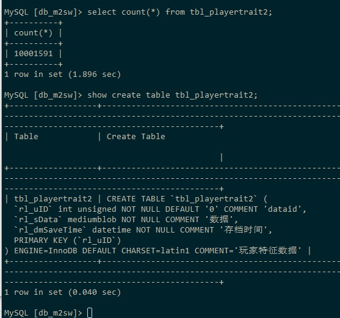
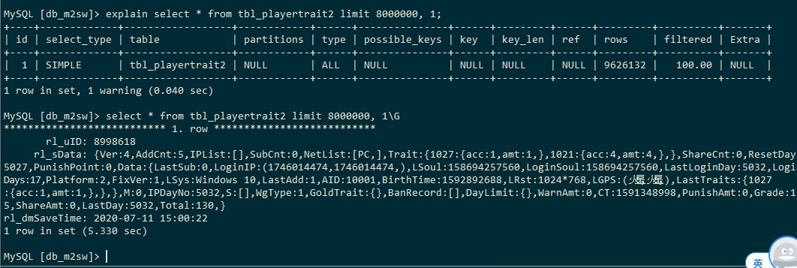
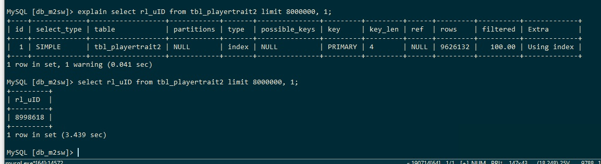
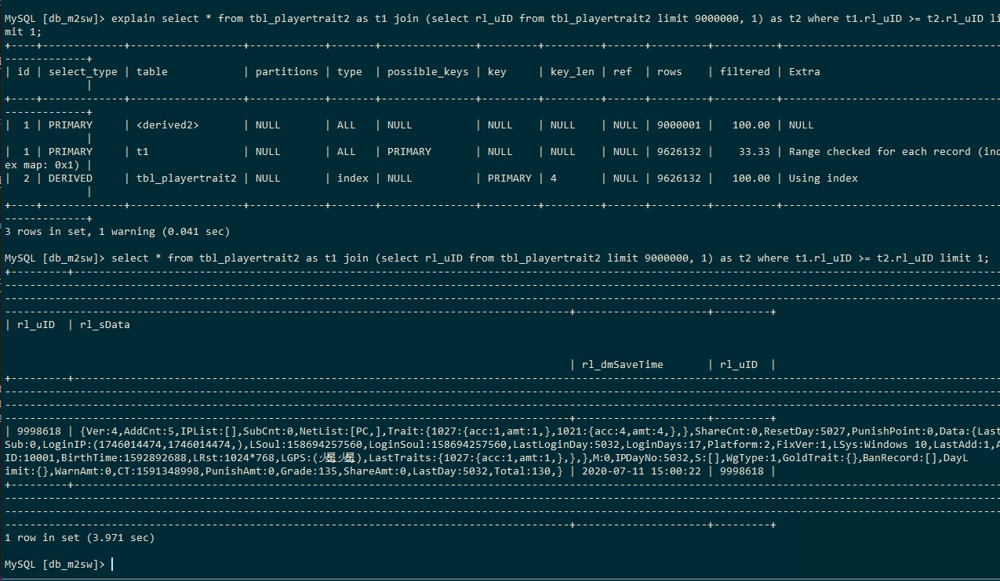
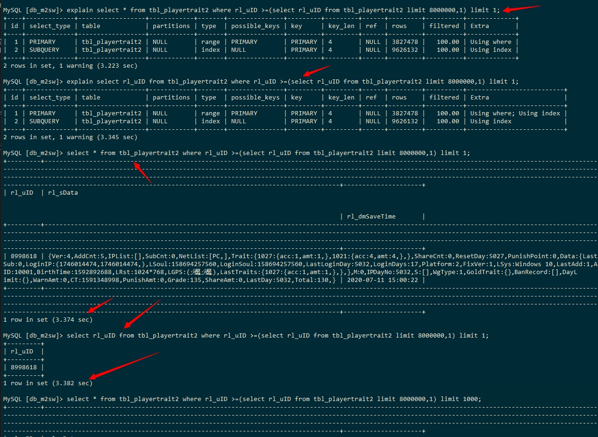
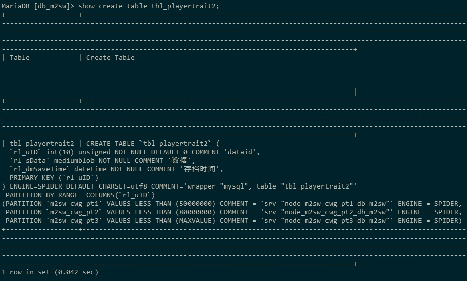

## select ... limit

### 0. 测试环境

- 

### 1. select * from tbl_test limit 10000, 10;

- 采用全表扫描，随着limit中offset的增大，耗时越长
- 注意，该sql没有采用任何的索引，没有使用任何的列，所以需要依次扫描表的每一行，直到累计到offset（即10000）
- 

### 2. select rl_uID from tbl_playertrait2 limit 8000000,1；

- 加载索引文件，依次读取每一个索引项，直到offset
- 因为扫描的是索引，索引要比数据文件的扫描快很多
- 

### 3. select * from tbl_playertrait2 as t1 join (select rl_uID from tbl_playertrait2 limit 9000000, 1) as t2 where t1.rl_uID >= t2.rl_uID limit 2;

- 跟子查询的效率差不多
- 

### 4. select rl_uID from tbl_playertrait2 where rl_uID >=(select rl_uID from tbl_playertrait2 limit 8000000,1) limit 1; 

- 子查询，使用index，定位到offset处的rl_uID的值
- 

### 5. spider针对 select ... limit的优化

- select * from tbl_test limit 1, 10;
- 基于rl_id分区：1-200(ptr1)  200-maxvalue(ptr2)
- spider发送到ptr1的语句：select * from tbl_test limit 1, 10;
- spider发生到ptr2的语句：select * from tbl_test limit 10;
- 这里发生了优化，没有把offset传递过来，直接要ptr2的前10行数据，这样可以减少在ptr2的查询时间
  

### 6. spider使用select ... limit的方案

1. select rl_uID from tbl_player limit1;
    - 查出tbl_player表的第一行数据对应的 rl_uID
2. select rl_uID from tbl_player where rl_uID > [步骤1的值] limit 10000;
    - 以[步骤1的值]作为where的条件，并使用limit做出限制
3. select rl_uID from tbl_player where rl_uID > [步骤2中结果的最后一个值] limit 10000;
    - 以[步骤2中结果的最后一个值作为where的条件，并使用limit做出限制
4. 循环第二、三步，直至结束

### 7. 问题

1. select rl_uID from tbl_playertrait2 limit 8000000,1；单独在MySQL上执行花费 3.8s左右，但是在spider上却要10s
    1. 10000000行的数据在一个分区上
    2. 