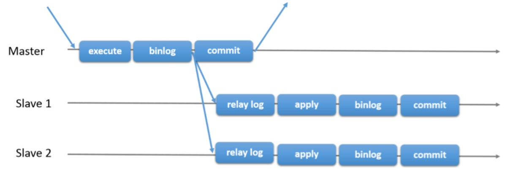
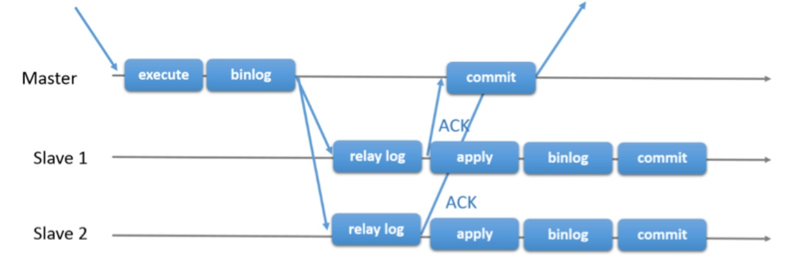
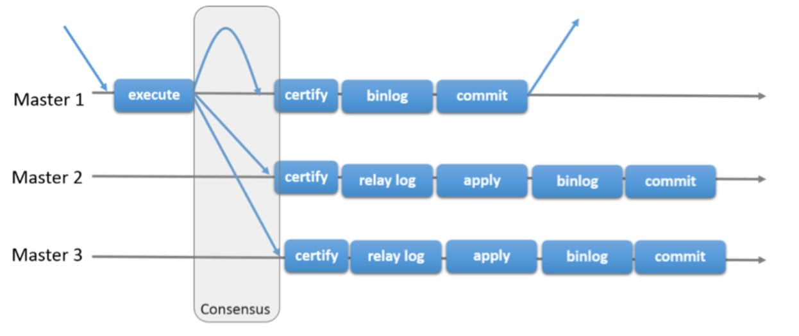
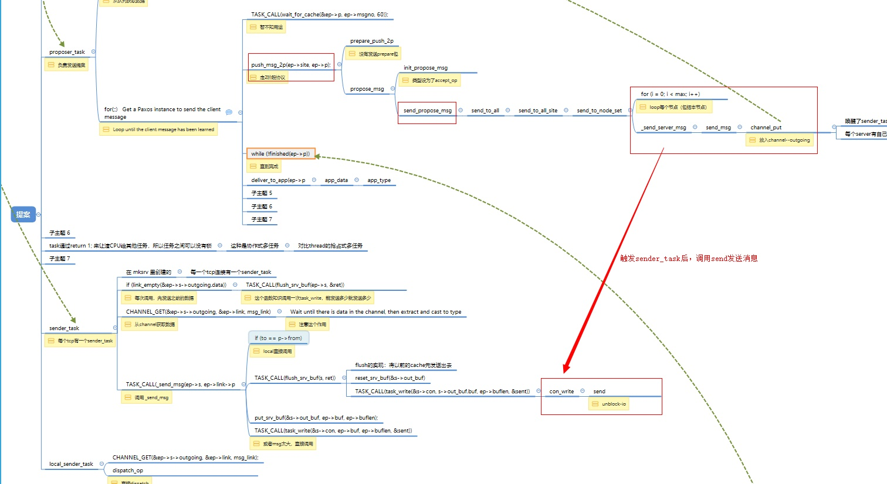
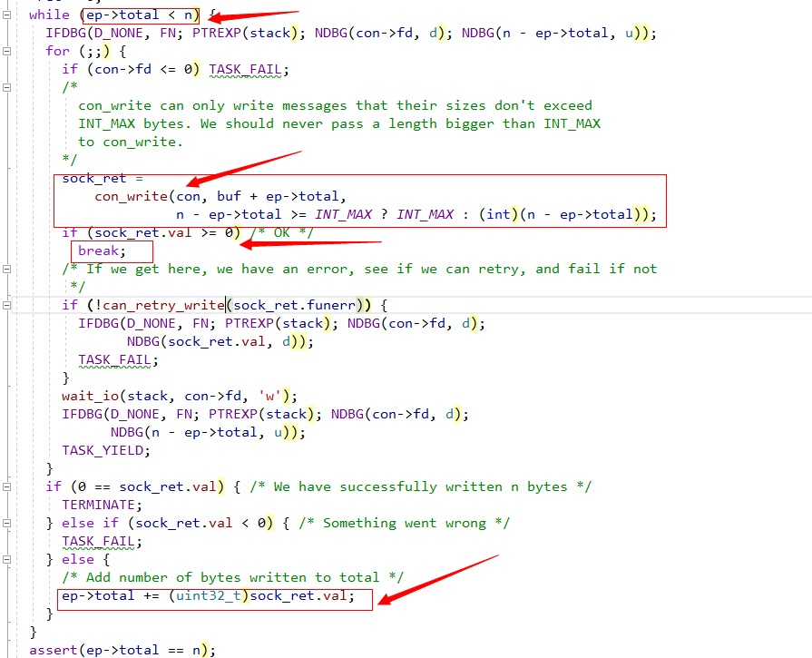
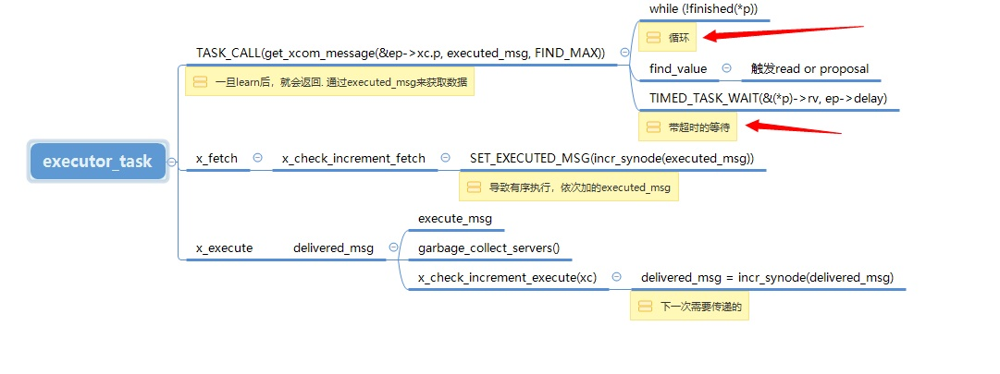

# MySQL · 引擎特性 · Group Replication内核解析

## 背景

1. 主要为了查证以下几个问题：
   1. mgr的节点跨机房后，mgr的效率受到很大影响，这直接导致mysql处理事务的吞吐量的急剧下降。需要从源码层面找到根因
   2. mgr运行一段时间后，其节点的内存会随着运行时间的增长而逐渐增长，最终增长到2.5~3G的样子。这导致节点mysql需要消耗较多的内存，一个mysql节点消耗3G内存，一个mgr组就要消耗9G的内存。需要定位内存消耗的原因。
      - 这里有一个前提：能够确定增长的这些内存是耗在了mgr里

## mysql的复制技术

### 复制技术的背景

> &emsp;为了创建高可用数据库系统，传统的实现方式是创建一个或多个备用的数据库实例，原有的数据库实例通常称为主库master，其它备用的数据库实例称为备库或从库slave。当master故障无法正常工作后，slave就会接替其工作，保证整个数据库系统不会对外中断服务。master与slaver的切换不管是主动的还是被动的都需要外部干预才能进行，这与数据库内核本身是按照单机来设计的理念悉悉相关，并且数据库系统本身也没有提供管理多个实例的能力，当slave数目不断增多时，这对数据库管理员来说就是一个巨大的负担。

### MySQL的传统主从复制机制

> &emsp; MySQL传统的高可用解决方案是通过binlog复制来搭建主从或一主多从的数据库集群。主从之间的复制模式支持异步模式(async replication)和半同步模式(semi-sync replication)。无论哪种模式下，都是主库master提供读写事务的能力，而slave只能提供只读事务的能力。在master上执行的更新事务通过binlog复制的方式传送给slave，slave收到后将事务先写入relay log，然后重放事务，即在slave上重新执行一次事务，从而达到主从机事务一致的效果。

> 
> &emsp;&emsp;上图是异步复制(Async replication)的示意图,在master将事务写入binlog后，将新写入的binlog事务日志传送给slave节点，注意：**但并不等待传送的结果，就会在存储引擎中提交事务**。

> 
> &emsp;&emsp;上图是半同步复制(Semi-sync replication)的示意图，在master将事务写入binlog后，将新写入的binlog事务日志传送给slave节点，**但需要等待slave返回传送的结果**；slave收到binlog事务后，将其写入relay log中，然后向master返回传送成功ACK；master收到ACK后，再在存储引擎中提交事务。 MySQL基于两种复制模式都可以搭建高可用数据库集群，也能满足大部分高可用系统的要求，但在对事务一致性要求很高的系统中，还是存在一些不足，**主要的不足就是主从之间的事务不能保证时刻完全一致。**

> **分析**
> 
> - &emsp;&emsp;基于异步复制的高可用方案存在主从不一致乃至丢失事务的风险，原因在于当master将事务写入binlog，然后复制给slave后并不等待slave回复即进行提交，若slave因网络延迟或其它问题尚未收到binlog日志，而此时master故障，**应用切换到slave时，本来在master上已经提交的事务就会丢失**，因其尚未传送到slave，从而导致主从之间事务不一致。这种情况发生的概率还是比较大的，但也有优势：master处理事务的效率不受影响
> - &emsp;&emsp;基于semi-sync复制的高可用方案也存在主备不一致的风险，原因在于当master将事务写入binlog，尚未传送给slave时master故障，此时应用切换到slave，虽然此时slave的事务与master故障前是一致的，**但当主机恢复后，因最后的事务已经写入到binlog，所以在master上会恢复成已提交状态，从而导致主从之间的事务不一致**。
> - 注意master都是在写入binlog之后，才开始同步的，问题的根因就源于此。mysql的机制确保只要写入binlog，那么这个事务就成功了，commit的作用可看作是通知client这个事务完成了。采用上述两种方案作为高可用方案时，client在特定的情况下收不到事务成功的反馈，而实际上事务在mysql上是执行成功的

### Group Replication应运而生，作为高可用方案

> 为了应对事务一致性要求很高的系统对高可用数据库系统的要求，并且增强高可用集群的自我管理能力，避免节点故障后的failover需要人工干预或其它辅助工具干预，MySQL5.7新引入了Group Replication，用于搭建更高事务一致性的高可用数据库集群系统。基于Group Replication搭建的系统，不仅可以自动进行failover，而且同时保证系统中多个节点之间的事务一致性，避免因节点故障或网络问题而导致的节点间事务不一致。此外还提供了节点管理的能力，真正**将整个集群做为一个整体对外提供服务**。

> 
> &emsp;&emsp;上图是组复制的示意图，当master执行事务之后，mgr插件接管该事务的处理，此时mysql将等待mgr插件处理完成，mgr插件首先同基于paxos开发的xcom将事务的执行结果同步到组内的其他节点（即consensus过程），当同步完成后，master启动认证处理，如果认证通过则写入binlog并commit，如何认证失败则rollback
> &emsp;&emsp;certify模块主要负责检查事务是否允许提交，是否与其它事务存在冲突，如两个事务可能修改同一行数据。在单机系统中，两个事务的冲突可以通过封锁来避免，但在多主模式下，不同节点间没有分布式锁，所以无法使用封锁来避免。为提高性能，Group Replication乐观地来对待不同事务间的冲突，乐观的认为多数事务在执行时是没有并发冲突的。事务分别在不同节点上执行，直到准备提交时才去判断事务之间是否存在冲突
> mgr提供了一下特性
> - 闭环(closed group)：只有组内成员才能给组成员发送消息，不接受组外成员的消息。
> - 消息全局有序(total order)：所有XCOM传递的消息是全局有序，这是构建MySQL 一致性状态机的基础。
> - 消息的安全送达(Safe Delivery)：发送的消息必须传送给所有非故障节点，必须在多数节点确认收到后方可通知上层应用。
> - 视图同步(View Synchrony)：在成员视图变化之前，每个节点都以相同的顺序传递消息，这保证在节点恢复时有一个同步点。实际上，组复制并不强制要求消息传递必须在同一个节点视图中

---

## 问题一：mgr的节点跨机房后，mgr的效率受到很大影响

> 这个问题主要涉及mgr的消息传递，以3节点的single-leader-mgr举例，设node1是leader节点，所有的rw事务都是由leader触发的，mgr的部署场景为node1和node2在机房1，node3在机房2，那么mgr是如何影响leader的事务处理能力的？按最初的理解，当事务在node1执行后，node1通过mgr同步事务，只要同机房的node2收到事务，那么node1就可以commit事务了，貌似并不需要node3的参与，node1跟node3他们之间同步事务就行了，但事实并非如此，这就需要分析xcom的消息传输

### mgr插件接管事务的处理

> 
> mgr主要在mysql-commit时hook了commit，收集需要传输的数据，并启动mgr的consensus流程（gcs_module->send_message(*transaction_msg)），然后等待mgr完成同步事务
> 
> 收集的数据：
> 
> - Transaction_context_log_event
> - Gtid_log_event
> - Query_log_event

### 消息传输

> 
>
> &emsp;这里只截取了关键的流程，当mgr同步事务时，mgr会提出一个proposal，这个proposal需要发送给组内的每个节点
> 关键点就在于，发送是在单线程中处理的。如图中标注的，mgr会提出一个proposal会触发3次sender_task，这个sender_task可看作是协程，单线程依次执行发送任务，可简化为 `[proposal-->node1; proposal-->node2; proposal-->node3]`，协程的一个特性就是只有在当前协程完成或者需要挂起的时候，才会执行下一个，而这个消息传输的sender_task会确保消息传输完成了或者unblock-socket不可写了（写缓冲区满了）这就需要下一轮调用该协程
 

> 
> 
> &emsp; 上图为unlock-socket的发送流程，虽然当send()写满其写缓冲区后就马上返回，并不等待所有的数据都发送完成，当write-buffer满了之后返回`Operation Would Block`, 会触发`wait_io`和`TASK_YIELD`结束该协程，直到unblock-socket再次可写才再次调用该协程；或者一次调用就把所有的数据写入缓冲区了
>
 

> **分析**：
> &emsp; 综上来看，这个单线程的协程发送流程并不会干扰mgr的发送性能，应该是有其他因素干扰

### 消息全局有序

> 
> 
> &emsp; &emsp; xcom执行task时，是按序执行的（举例三个节点 nodeA，nodeB，nodeC，在当前节点nodeA，要求执行顺序必须是 nodeA-1，nodeB-1，nodeC-1，nodeA-2，nodeB-2，nodeC-2，（举例，nodeC是在另一个机房的节点的话，作为primary节点的nodeA也会等待nodeC-1达成共识（TIMED_TASK_WAIT()带超时的阻塞），而nodeC-1是由nodeC发出的消息（这其中还会涉及到state-detector失败探测））如果nodeC同其他节点的通信相对较慢，但还没有达到怀疑nodeC的状态是dead的情况，那就会导致xcom的执行变慢。
> &emsp; &emsp; `nodeA-1，nodeB-1，nodeC-1，nodeA-2，nodeB-2，nodeC-2，（举例，nodeC是在另一个机房的节点的话，作为primary节点的nodeA也会等待nodeC-1达成共识（TIMED_TASK_WAIT()带超时的阻塞），而nodeC-1是由nodeC发出的消息` 这个是不一定的，作为primary节点的nodeA在某些情况下也会提出消息nodeC-1，但基于paxos协议，如果此时nodeC在此之前已经提出了nodeC-1，那么这两个提案最终只会输出一个相同的值，如果nodeA同nodeC的通信在容忍的范围内，那么输出的值为nodeC提出的nodeC-1，如果nodeA提起提案nodeC-1，但是nodeC在容忍时间内没有回应，nodeB回应了，因达到大多数所以输出的值为nodeA提起的nodeC-1，nodeC也会学到nodeA提出的值，这应该又涉及到了**失败探测这些东西，这些内容到目前为止还没有搞清楚**

---
**综上分析：**

1. mgr的节点跨机房后，mgr的效率受到很大影响，节点间通信延迟的最大值就是mgr的瓶颈
2. 节点间的通信采用协程-单线程发送，这个机制不会影响节点间的通信，因为xcom是大多数通过即成功的协议
3. 消息的全局有序，xcom对这个特性的实现，导致