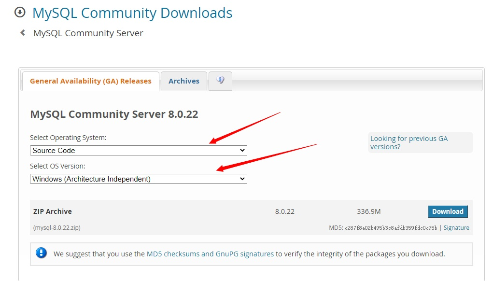

# 1. windows源码编译

[ddd](#1cmake_generate)

## 0. 参考

- <https://dev.mysql.com/doc/refman/8.0/en/source-installation-prerequisites.html>

</br>
## 1. mysql源码位置
1. github 搜索 mysql-server

## 2. 依赖的第三方软件

1. boost
   - cmake执行configure，如果缺少boost，它会提示你正确的boost版本，然后去下载
</br>
2. ssl
   - openssl:
   - WITH_SSL=path_name ....... 指定openssl的安装路径
</br>
3. bison
   - s

## 3. 开发版本的源码构建

- 源码获取：
  - github 搜索 mysql-server


## 4. 分发版本的构建

- windows版本源码获取：
  - <https://dev.mysql.com/downloads/mysql/>
  - 
- **分发版本的源码，跟开发版本的源码有所不同**。dist版本，自带bison的生成文件，并且是在src目录里的，而开发版本没有携带，需要使用cmake调用bison自己生成文件，并且文件位于build目录。控制这个选项的cmake-option是 【USE_BISON_RESULTS_FROM_MAKE_DIST】

## 5. 带debug调试

- CMake的配置项：WITH_DEBUG=1

## 6. cmake configure

- configure的含义
  - 配置生成build-system或build项目的先决条件，如需要一些第三方库：boost、ssl，第三方工具：bison
  - 使用工具预先生成一些文件：如使用bison生成语法分析器的文件
  - 配置一些编译项，如是debug版本还是release版本，是全部构建还是仅仅构建某个组件
  - 配置一些控制项，如是否使用ssl，是否开启debug
    </br>
- 处理configure过程中的bug
  - 下载对应版本的boost，配置cmake缓存项 [WITH_BOOST]
  - 下载openssl
  - 下载bison
  - 如果开发版本的源码，可能会提示找不到文件sql_yacc.h
    - 在源码目录先找不到sql_yacc.h文件，是由于开发版本源码目录是不带这些文件的，需要使用bison自己生成
    - 将cmake-option [USE_BISON_RESULTS_FROM_MAKE_DIST] 设为off

## 7. cmake generate

- 生成build-system

## 8. vs构建生成mysql可执行程序

  1. 编译报错，处理方法一
      - 源码文件包含一些无法处理的字符，这些文件，使用note-pad++打开，保存为utf-bom格式
    </br>
  2. 编译报错，处理方法二
     - 在src/CMakeLists.txt的开头加入以下内容

          ``` shell
          add_compile_options("$<$<C_COMPILER_ID:MSVC>:/utf-8>")
          add_compile_options("$<$<CXX_COMPILER_ID:MSVC>:/utf-8>")
          ```

      </br>
  3. 产生这个【编译报错】问题的原因：
     - 字符集有两个概念：源字符集和执行字符集
     - build/scripts/sql_commands_help_data.h文件是utf8编码，这是源字符集
     - vc编译build/scripts/sql_commands_help_data.h文件后，在内存里却是gbk编码，这是执行字符集
     - build/scripts/sql_commands_help_data.h这个文件里有【`SET NAMES 'utf8';`】表示client传递给mysql的是utf8编码，但实际传输的是gbk编码的内容
    </br>
  4. 调试代码
      - vs工程/工程属性/c++/优化/内联函数扩展：改为禁用
      - cmake选项：WIN_DEBUG_NO_INLINE 设为 true
        - 这个选项在src/cmake/os/windows.cmake里控制

## 9. 构成完成后，运行install项目，将mysql安装到制定目录

  1. 由CAMKE_INSTALL_PREFIX控制

## 10. 初始化数据目录

1. `mysqld --console --basedir=../ --datadir=../data/mysql3307 --initialize --debug="d,error:o,d:/mysqld.trace:F:i"`
   - --debug的作用：
     - 在mysql的构建携带WITH_DEBUG=1时，此选项用于输出调试信息
    ---
2. mysqld报错：时区错误
   - 定位test_lc_time_sz()@sql/mysqld.cc，将其中的DEBUG_ASSERT(0)注释掉
    ---
3. mysqld报错：incorrect string value
   - 这些文件，重新生成由GenBootstrapPriv工程控制
   - 这些文件，其生成依赖comp_sql工程控制
   - 这些文件，由src/srcitps/CMakeLists.txt控制
   - 这些文件，最终生成在build/scripts
   - help_topic表的create，在src/srcipts/mysql_system_tables.sql和build/srcipts/mysql_fix_privilege_tables.sql
   - 处理
     - 方法一：
       - 将sql_commands_help_data.h里的insert into help_topic删除或仅剩下第一行
     - 方法二：
       - 将src/scripts/fill_help_tables.sql转成gbk编码，将`SET NAMES 'utf8';`改为`SET NAMES 'gbk';
       - 重新执行GenBootstrapPriv
       - 重新构建mysqld
       - 重新执行install
     - 方法三：
       - 将build/scripts/sql_commands_help_data.h里的字符串改为 u8"insert into help_topic"
     - 处理方法四：
       - 在src/CMakeLists.txt的开头加入以下内容

         ``` sql
         add_compile_options("$<$<C_COMPILER_ID:MSVC>:/utf-8>"
         add_compile_options("$<$<CXX_COMPILER_ID:MSVC>:/utf-8>")
         ```

    ---
4. 产生这个【incorrect string value】问题的原因：
   - 字符集有两个概念：源字符集和执行字符集
   - build/scripts/sql_commands_help_data.h文件是utf8编码，这是源字符集
   - vc编译build/scripts/sql_commands_help_data.h文件后，在内存里确是gbk编码，这是执行字符集
   - build/scripts/sql_commands_help_data.h这个文件里有【`SET NAMES 'utf8';`】表示client传递给mysql的是utf8编码，但实际传输的是gbk编码的内容

## 11. 修改root密码

- `alter user 'root'@'localhost' identified by 'zhanglei';`
